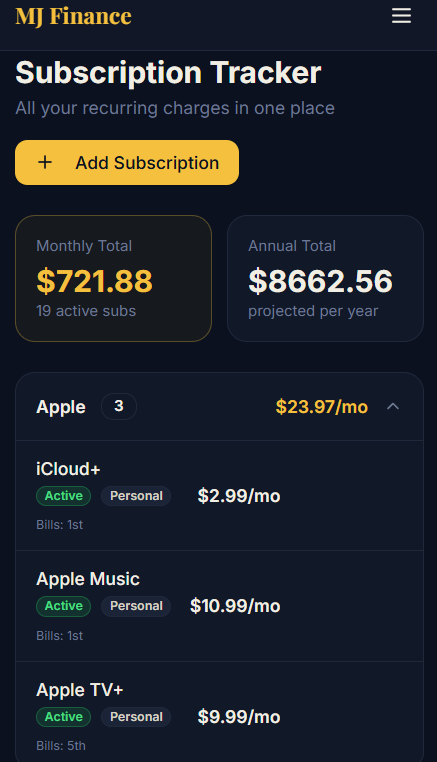
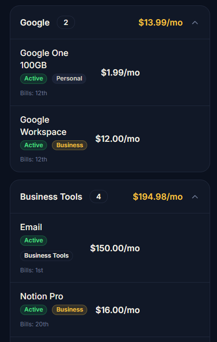
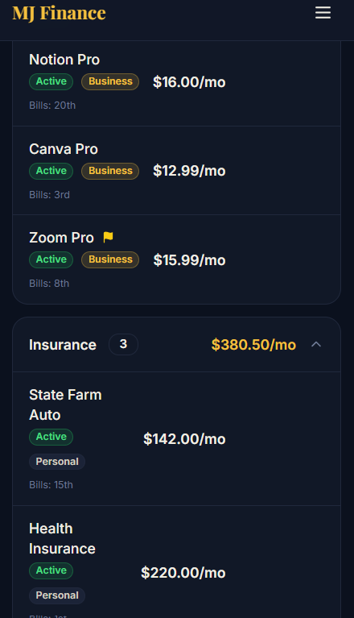

# 🏦 Automated Financial Intelligence Pipeline for MJ Wealth Track (MJ Finance)

An automated, serverless data pipeline that intercepts financial transactions directly from a Gmail inbox and securely syncs them to the backend database of the **MJ Wealth Track** application via a custom Deno Edge Function proxy.

## 📱 Application Dashboard Preview

<p align="center">
  
  
  
</p>

## 🗺️ System Architecture

```text
┌────────────────┐          (Every 6 Hours)          ┌──────────────────────┐
│  Gmail Inbox   │ ────────────────────────────────> │  Google Apps Script  │
│ (User Receipt) │                                   │ (Scan & Regex Parse) │
└────────────────┘                                   └──────────────────────┘
                                                                │
                                                                │  POST Request (JSON)
                                                                ▼
┌────────────────┐          Silently Saves To        ┌──────────────────────┐
│ MJ Wealth Track│ <──────────────────────────────── │  Base44 Edge Proxy   │
│  DB (App UI)   │       asServiceRole Privilege     │ (subscriptionReminder)│
└────────────────┘                                   └──────────────────────┘


Key Technical Accomplishments
-Advanced Endpoint Reverse-Engineering: Re-engineered an under-utilized Deno Edge Function (subscriptionReminder.ts) to bypass managed platform route restrictions, enabling secure data injection via Supabase asServiceRole privileges.
-Automated Sync & Guardrails: Deployed a time-driven Google Apps Script trigger (6-hour intervals) with structural exception handling that flags and drops payloads returning a value of 0 (e.g., promotional emails), protecting production tables from data clutter.
-Platform Validation: Confirmed via a live $14.99 billing alert that the application's core automated countdown scheduler operates independently and remains uncompromised by external background database writes.

Active Optimization Roadmap
-Upgrade A (Semantic Domain Vendor Extractor): Refactoring extractVendor() to isolate primary corporate domains directly from sender metadata, resolving string-matching bugs (such as fixing unstructured formatting that defaults to a generic "Email" vendor flag).
-Upgrade B (Character Boundary Truncation): Restricting parsing to the first 2,000 characters of an email body to programmatically ignore long marketing footers, ad links, and privacy policy texts that cause false transaction flags.
-Upgrade C (Double-Pass Validation Loop): Introducing multi-conditional routes for senders like Eventbrite to seamlessly capture legitimate community funding receipts while filtering out standard calendar event invitations and marketing reminders.

Tech Stack & Protocols
-Automation: Google Apps Script (V8 Runtime)
-Backend Runtime: Deno / TypeScript
-Database & Security: Supabase REST API & JWT (Service Role Access)
-Scheduling: Time-driven Cloud Triggers (6-Hour Cron)
